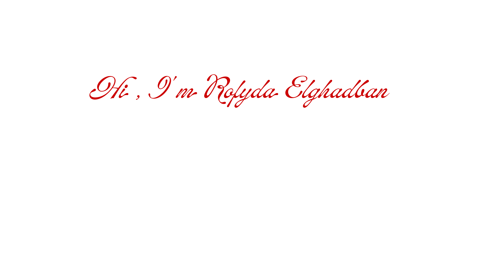

	
<!--<h1 align="center">Hi , I'm Rofyda Elghadban </h1> -->
<p align="center">
  
</p>


<!-- <h1 align="center">,<a href="https://img.shields.io/badge/Rofyda%20Elghadban-%23ff4d6d?style=for-the-badge"> </a></h1> -->
	
	
  <a href="https://github.com/DenverCoder1/readme-typing-svg"></a>
</p>

<h2> 👩‍💻 About me </h2>

- 🎓 ```Fresh Graduate``` from [Faculty of Computers & Informatics](http://suez.edu.eg/ar/%d9%83%d9%84%d9%8a%d8%a9-%d8%a7%d9%84%d8%ad%d8%a7%d8%b3%d8%a8%d8%a7%d8%aa-%d9%88%d8%a7%d9%84%d9%85%d8%b9%d9%84%d9%88%d9%85%d8%a7%d8%aa/) , [Suez Canal University](http://suez.edu.eg/ar/) ```Computer Science Department```.

- 👩‍🏫 Currently working as a ```Coach``` @Coach Academy, guiding and supporting learners on their journey.

- 🚀 ```ECPC Finalist``` – [Egyptian Collegiate Programming Contest](https://www.facebook.com/EgyptCPC).

- :computer: I am a competitive programmer at `Codeforces`, `Atcoder`, `Leetcode`, `Codechef`.
  
- 📝 This is [MY RESUME](https://drive.google.com/file/d/1cW9vGeXznG6uIgoBzp62lTckx9RBiMgA/view?usp=sharing).


<br>
<p align="left">  </p>


## 👉 How to reach me 


<!-- -->
<p align="center">                        
<a href="https://codeforces.com/profile/Rofyda_Elghadban" target="blank">    </a>
 <a href="http://www.linkedin.com/in/rofydaelghadban" target="blank"></a>        <a href="https://www.facebook.com/RofydaElghadban?mibextid=ZbWKwL" target="blank"></a>

</p>


## 👉 Programming languages
<p align="center">
 <a href="https://www.cprogramming.com/" target="_blank" rel="noreferrer">  </a> <a href="https://www.w3schools.com/cpp/" target="_blank" rel="noreferrer">  </a>  <a href="https://www.w3.org/html/" target="_blank" rel="noreferrer">  </a> <a href="https://www.java.com" target="_blank" rel="noreferrer">  </a>  </p>
</p>

## 👉 IDEs
 
<p align="center">
  &emsp;
    <a href="#"></a>
</p>

## 🔥 Streak Stats
<p align="center"></p>

## 💻 GitHub Profile Stats
 
  <p align="center">
    <a href="https://github.com/anuraghazra/github-readme-stats"></a></p>


